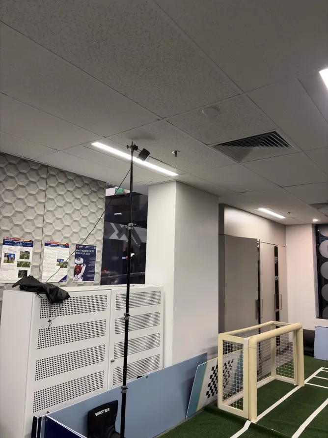
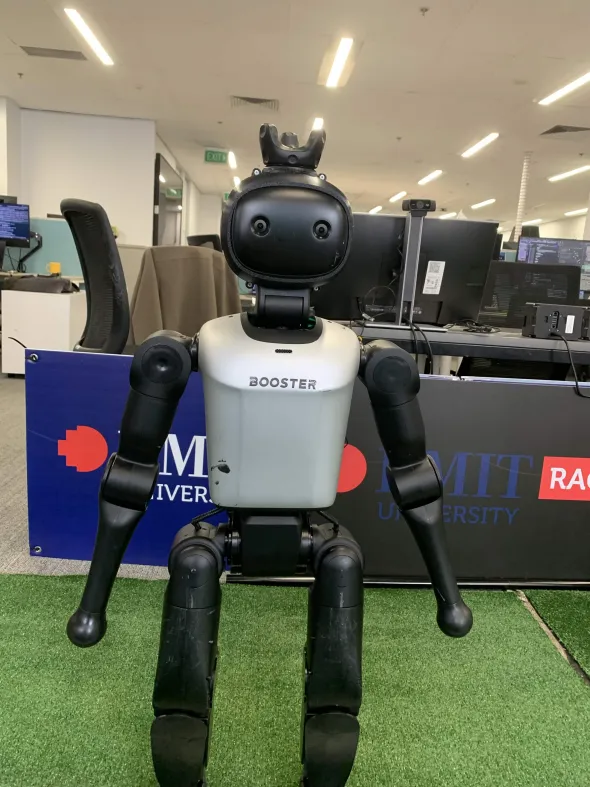
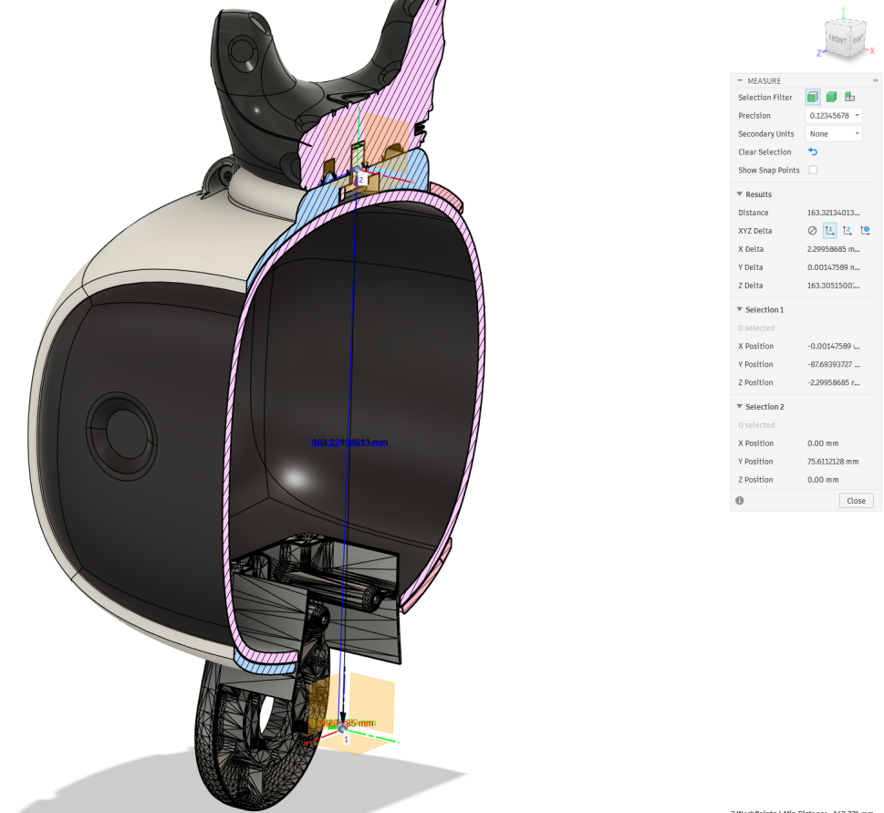
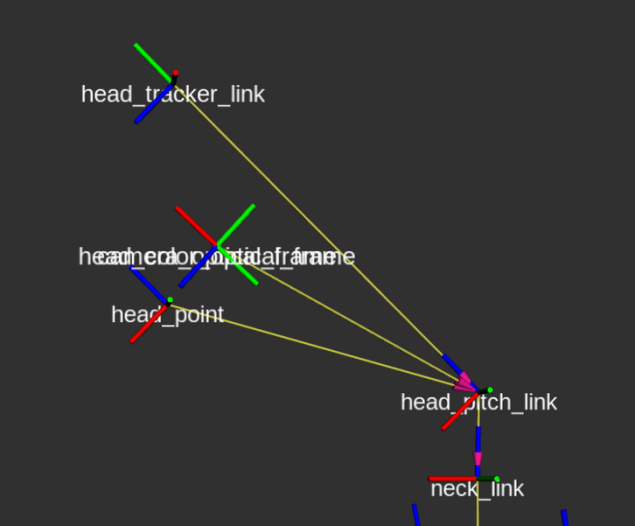
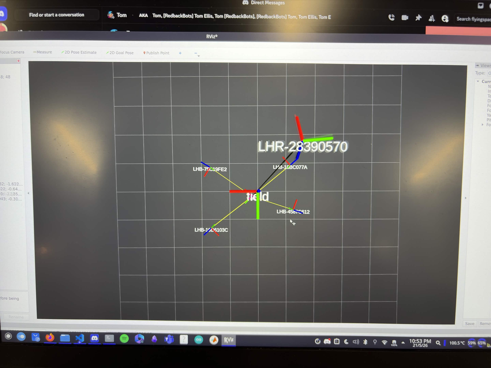
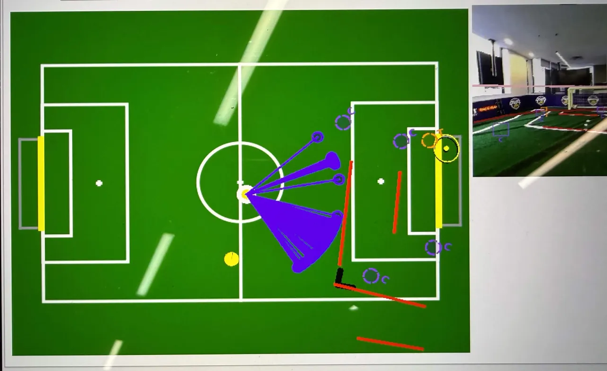
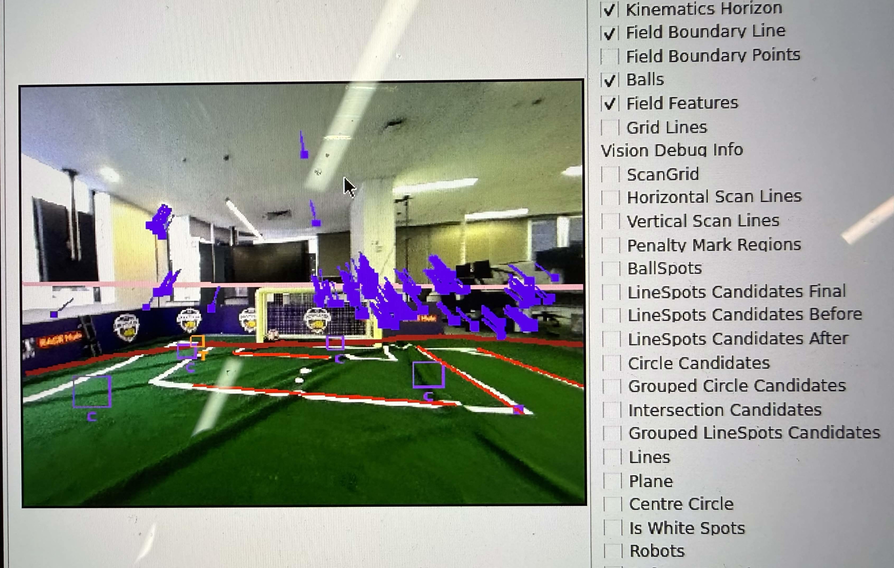
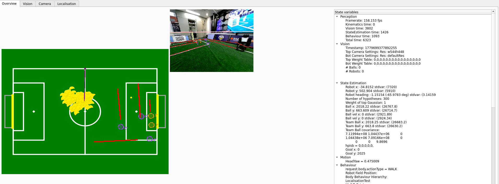
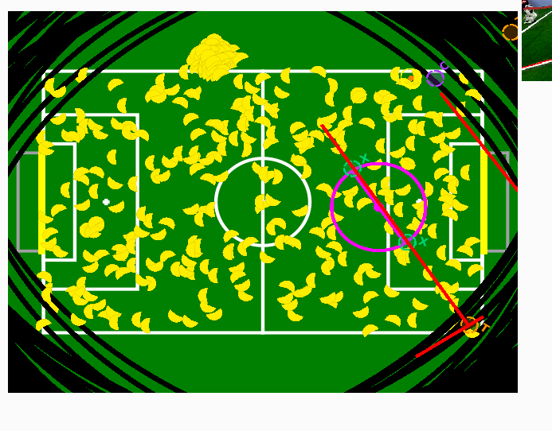

# Evidence of Individual Work: Progress Demonstration

> Compiled from git logs, branches, PRs, and issues.
> Date: 2026-05-28
> Repository: `par-as3` (root) + `soccer/` (submodule -> redbackbots-soccer)

---

## Repository Overview

| Component | Path |
|-----------|------|
| Root repo | `/home/rmitaiil/Documents/par-as3` |
| Submodule (shared codebase) | `soccer/` |
| Issues | `.issues/` |
| Demo docs | `docs/week-12-demo/` |

**Diff stats (PAR/particle_filter_based_localisation vs main):**
```
274 files changed, 25615 insertions(+), 1852 deletions(-)
```

---

## SAM GRIFFITHS: `PAR/localisation_replay`

**Role:** Booster infrastructure, localisation replay tooling, and HTC Vive external pose estimation

### Branch: `origin/par/localisation_replay`

### Commits (16 unique, not in main):

| Commit | Author | Description |
|--------|--------|-------------|
| `877a0353` | Sam Griffiths | **feat: standalone localisation replay runner** |
| `8537fd00` | Sam Griffiths | **feat: working localisation replay - to clean** |
| `0d2c73d0` | Sam Griffiths | fix: Compile symlinks to path directs (#220) |
| `68bf6111` | Sam Griffiths | Feat/update sdk to 1.6 (#188) |
| `b008db07` | Sam Griffiths | import is nao and is booster (#206) |
| `36cf7d33` | Sam Griffiths | docs: comment (#207) |
| `83ccd711` | Sam Griffiths | fix topic names V1.6 (#186) |
| `88064afc` | Sam Griffiths | Fix: odom 2 (#187) |
| `c242f688` | Sam Griffiths | Feature/username checking warning setup (#149) |
| `b7423fbc` | Sam Griffiths | Fix: Odom (#176) |
| `e1ecc7da` | Sam Griffiths | Partial line segments (#109) |
| `d6d187d3` | Sam Griffiths | Update exitVisualKick (#160) |
| `8bba121c` | Sam Griffiths | Feat/implement ssh key handling (#118) |

### Key Deliverables:

1. **Standalone Localisation Replay Runner** (`877a0353`, `8537fd00`)
   - Offline replay of recorded localisation data for testing and evaluation.
   - Enables debugging without requiring live robot operation.
   - **How it improves localisation:** Allows iterative testing of the particle filter on recorded field data without tying up the Booster K1 hardware. This accelerates debugging and parameter tuning by providing reproducible replay of real robot runs.

2. **HTC Vive External Pose Estimation (Ground Truth)**
   - Set up SteamVR tracking with multiple base stations for sub-millimetre ground truth pose data.
   - Designed and fabricated a 3D-printed mounting hat for the Vive tracker on the Booster K1.
   - Integrated Vive TF tree into the ROS2 ecosystem for synchronised ground truth vs estimated pose comparison.
   - **How it improves localisation:** Provides an independent, high-precision ground truth measurement that enables rigorous quantitative evaluation of the particle filter's accuracy. Without this, we cannot objectively measure localisation error or produce the statistical analysis required for the PG experimental evaluation.

   
   </br>*HTC Vive base stations mounted on tripods for SteamVR tracking coverage.*


   
   </br>*3D-printed mounting hat for the Vive tracker, attached to the Booster K1.*

   
   </br>*3D CAD model of the custom mounting hat design.*

   
   <br>
   *ROS TF tree showing the transformation chain from SteamVR tracking origin to Booster K1 base link.*

   
   *Full external pose estimation setup with four base stations, field origin calibration, and tracker on the robot.*

---

## ERIC (Minh Hoang Pham): `PAR/natural_landmark_localisation` & `PAR/natural_landmark_heading`

**Role:** Natural landmark-based symmetry breaking for localisation

### Phase 1: `origin/PAR/natural_landmark_localisation` (Feature Extraction, Abandoned)

Eric initially pursued natural landmark feature extraction to break symmetry on the soccer field. This approach aimed to identify unique visual landmarks from the field perimeter to extract pose. It was subsequently abandoned in favour of a more efficient heading-only approach.

| Commit | Author | Description |
|--------|--------|-------------|
| `bc5dae6e` | Minh Hoang Pham | **initial implementation** |
| `4a4896d5` | Minh Hoang Pham | **add visualisation to offnao** |
| `cd505b92` | Minh Hoang Pham | **relocate files** |
| `3795f190` | Minh Hoang Pham | **initial implementation** |

### Phase 2: `origin/PAR/natural_landmark_heading` (Global Heading Calculation, Current Approach)

Eric pivoted to a natural landmark heading approach, which calculates a global heading from observed landmarks to break localisation symmetry. This is more computationally efficient and directly addresses the field symmetry problem that plagues RoboCup localisation.

| Commit | Author | Description |
|--------|--------|-------------|
| `2514d61a` | Minh Hoang Pham | **persistent keypoint list matching** |
| `e5442912` | Minh Hoang Pham | change colour of lines and points |
| `d29adfdf` | Minh Hoang Pham | final vis fix |
| `cfeceff9` | Minh Hoang Pham | **exclude field features** |
| `eea81f12` | Minh Hoang Pham | fix colour |
| `ff2f6560` | Minh Hoang Pham | **add natural landmark vector to offnao** |
| `c3491f66` | Minh Hoang Pham | **new implementation, heading only** |

### Key Deliverables:

1. **Natural Landmark Heading Implementation** (`c3491f66`)
   - New heading-only approach to compute global orientation from environmental features.
   - More efficient than full landmark localisation.
   - **How it improves localisation:** The RoboCup field is symmetric (both halves look identical), which causes the particle filter to maintain multiple ambiguous modes. By computing a unique global heading from perimeter landmarks, this approach breaks the symmetry and helps the filter disambiguate which half of the field the robot is on, significantly reducing convergence time.

   
   <br>
   *Off-Nao visualisation showing the computed directional vector from detected natural landmarks, used to derive a unique global heading.*

   
   <br>
   *Robot point-of-view showing detected keypoints used for persistent landmark matching across frames.*

2. **Off-Nao Visualisation** (`ff2f6560`)
   - Added natural landmark vector display in the Off-Nao debugger.
   - Enables visual verification of landmark detection.

3. **Keypoint Matching** (`2514d61a`)
   - Persistent keypoint list matching across frames for stable landmark tracking.

4. **Feature Exclusion** (`cfeceff9`)
   - Excludes standard field features to focus on unique perimeter landmarks.
   - Avoids duplicating features already handled by the particle filter.

---

## THOMAS GOSLING (Tom): `par/pf-*` branches

**Role:** Particle filter parameter design, resampling implementation, core refactoring, bug fixes, informed seeding

**Note:** Thomas authored commits under both `Thomas Gosling` and `TomG`.

### Branch: `origin/par/pf-02/scaffolding` (Foundation and Data Types)

| Commit | Author | Description |
|--------|--------|-------------|
| `a88ebb21` | TomG | added particle filter README with parameter meaning and MVP design decisions |
| `09676a33` | TomG | added particle filter parameters file matching MMCMKF signature |
| `48097da4` | TomG | Added header for PF parameters class |
| `953940aa` | TomG | added PF constants header |
| `e10352aa` | TomG | added header for particle class |
| `e422f961` | TomG | Merge + comments on Particle.hpp clarifying heading in radians |
| `9213647d` | TomG | added particle filter README |
| `d216cb99` | TomG | added particle filter parameters file |
| `48bd1323` | TomG | Added header for PF parameters class |
| `5c7a8999` | TomG | added PF constants header |
| `fd2055a7` | TomG | added header for particle class |

**Deliverables:**
- `Particle.hpp`: particle struct (x, y, heading, weight).
- `ParticleFilterConstants.hpp`: NUM_PARTICLES (300), dimension indices.
- `ParticleFilterParams.hpp`/`.cpp`: parameter class with `readParams()`.
- `README.md`: parameter meaning and MVP design decisions.

---

### Branch: `origin/par/pf-03-S01/refactor-core-filtering-steps`

| Commit | Author | Description |
|--------|--------|-------------|
| `b843af43` | Thomas Gosling | **PF-03-S01: Move core-filtering implementations into ParticleFilter** |
| `817a77ed` | Thomas Gosling | **PF-03-S01: Add core-filtering method declarations to ParticleFilter** |
| `e368f65b` | Thomas Gosling | PF-03-S01: Remove core-filtering implementations from transitioner |
| `87410047` | Thomas Gosling | PF-03-S01: Remove core-filtering method declarations from transitioner |
| `c26edb1a` | Thomas Gosling | PF-03-S01: Add updateHeadingUncertainty and minWeightAdjustment params |

**Deliverable:** Clean separation of concerns: core filtering logic moved from `ParticleFilterTransitioner` into `ParticleFilter`, matching the established pattern.

---

### Branch: `origin/par/pf-06/adaptive-resampling`

| Commit | Author | Description |
|--------|--------|-------------|
| `e9aeb715` | Thomas Gosling | **Merge PR #247: par/pf-06/adaptive-resampling into PAR branch** |
| `10f1c4c0` | Thomas Gosling | **PF-06: Adaptive resampling with ESS/NEF (#235)** |
| `2daa9229` | Thomas Gosling | updated README: ESS/NEF based resampling strategy |
| `07078e99` | Thomas Gosling | added doxygen strings to resampling transitional methods |
| `eb12141a` | Thomas Gosling | **implemented resampleParticles with NEF based sampling trigger** |
| `01d68283` | Thomas Gosling | made ParticleFilter.rng public |

**Deliverable:** Adaptive resampling using Effective Sample Size (ESS) / Normalised Estimation Factor (NEF) triggers resampling only when particle diversity drops below threshold.
**How it improves localisation:** Without adaptive resampling, particles quickly degenerate (all weight concentrates on a few particles), causing filter divergence. By monitoring NEF and resampling only when needed, the filter maintains particle diversity while avoiding the computational cost of resampling every frame. This keeps the filter robust against ambiguous observations.

---

### Branch: `origin/par/pf-11/missing-parameter-inits`

| Commit | Author | Description |
|--------|--------|-------------|
| `dc528c9f` | Thomas Gosling | **added missing initialization of ParticleFilterParams** (distanceUncertaintyScale, minWeightAdjustment, updateHeadingUncertainty) |
| `6c011b67` | Thomas Gosling | added missing comments to ParticleFilterParams |
| `caa4c0bf` | Thomas Gosling | renamed ParticleFilterTransitioner.resetTopose -> resetToPose |
| `96b01834` | Thomas Gosling | removed deprecated update function declarations |

---

### Branch: `origin/par/pf-12/seg-fault-in-pf-constructor`

| Commit | Author | Description |
|--------|--------|-------------|
| `6bbc2dc2` | Thomas Gosling | **PF-12: added delete call for the parameters in ParticleFilter.cpp** |
| `13ce432a` | Thomas Gosling | **PF-12: added missing initialization of particle filter parameters** |

---

### Branch: `origin/par/pf-16/informed-particle-initialization-with-directional-features`

| Commit | Author | Description |
|--------|--------|-------------|
| `6fc9773b` | Thomas Gosling | **PF-16: create config file with all particle filter parameters** |
| `9516abca` | Thomas Gosling | **PF-16: update README with seeding strategy documentation** |
| `de0ff674` | Thomas Gosling | **PF-16: implement seeding methods and wire into observationUpdate()** |
| `c0033e3f` | Thomas Gosling | **PF-16: add seeding method declarations to ParticleFilter.hpp** |
| `93d4d2e5` | Thomas Gosling | PF-16: add seeding defaults and config options to ParticleFilterParams.cpp |
| `b23750b3` | Thomas Gosling | PF-16: add seeding parameter fields to ParticleFilterParams.hpp |
| `119692bf` | Thomas Gosling | PF-16: add seeding constant defaults to ParticleFilterConstants.hpp |

**Deliverable:** Observation-driven particle seeding from directional field features (corners, T-junctions, X-junctions, centre circle). When the robot spots a directional feature, it computes the implied pose and seeds a Gaussian cluster there.
**How it improves localisation:** Traditionally, particles are spread uniformly across the field and must converge through repeated weight updates and resampling, which can take many frames. Informed seeding accelerates this dramatically: a single observation of a corner or T-junction can place a dense cluster of particles near the correct pose, reducing convergence time from hundreds of frames to just a few.

---

### Also on `PAR/particle_filter_based_localisation` (Thomas Gosling, 6 commits)

| Commit | Description |
|--------|-------------|
| `f392e522` | Updated PF params to minimise early convergence and particle collapse |
| `d2e4cb9f` | **Added Roughening to Resampling step** |
| `e6b2af09` | add of observation position and heading to output logging |
| `68b181c6` | PF-03-S01: Refactor: Move core filtering logic (#237) |
| `10f1c4c0` | PF-06: Adaptive resampling with ESS/NEF (#235) |
| `8780d01f` | **PAR-02: Particle Filter Parameters (#233)** |

**How roughening improves localisation:** After resampling, particles tend to collapse to identical positions (all duplicating the highest-weight particle). Roughening adds small Gaussian noise to each resampled particle, preserving diversity and preventing the filter from converging to a single false hypothesis.

---

## MARK FIELD: `PAR/particle_filter_based_localisation`

**Role:** Main particle filter implementation lead, integration, core algorithm development

### Commits (38 unique, not in main):

| Commit | Description |
|--------|-------------|
| `4238b486` | **IT WORKS!!!!!!!!!!!!!!!!!**: functional particle filter milestone |
| `66ac9437` | segfault fixes |
| `84c76abd` | fix compile issues |
| `9b49cc21` | apply fixes |
| `c02d1bcf` | add prints |
| `377f2921` | handle all types of position resetting |
| `793ae070` | fix compile issues |
| `353e4ffe` | Update ParticleFilter.hpp |
| `9491def9` | Update ParticleFilter.hpp |
| `1d848a7f` | wip: mark |
| `571b3363` | fix compile errors |
| `ea0b302f` | docstring fixes |
| `e230dad9` | **add pf to localiser** |
| `d3d1579f` | add note for pf |
| `3db981cc` | get rid of whitespace |
| `f37e263f` | **add the pf to localiser** |
| `a43e3af6` | **add the pf to cmake** |
| `39c5631e` | **create the draft update functions** |
| `5c06c386` | add uncertainty scale |
| `b42b8ac0` | fix imports |
| `120b9978` | add a way to multiply weights |
| `798bb397` | Update transition with framework for localisation update |
| `fe5628fb` | **Add field features to observations** |
| `5f486674` | constants changes and add middle info to observations |
| `780bc23f` | wip: filling out the pf framework |
| `eaca465f` | docstring fixes |
| `171f6886` | need access to the list of particles elsewhere |
| `17a88526` | **Add particle filter transitioner framework** |
| `daf78f4b` | **Basic functions of the particle filter with docstrings attached** |
| `ac39c286` | **Class for holding the particle data** |
| `ed90bda9` | wip: basic layout of stuff |
| `775f6612` | **initial files: basically copies of CMKF** |

### Key Deliverables:

1. **Foundation:** Created initial particle filter files based on CMKF pattern (`775f6612`)
   - `Particle.hpp`: particle data structure.
   - `ParticleFilter.hpp`/`.cpp`: main filter class.
   - `ParticleFilterTransitioner.hpp`/`.cpp`: game state transition handler.
   - **How this improves localisation:** The particle filter is a non-parametric estimator that can represent multi-modal probability distributions (unlike the Kalman filter's single Gaussian). This means the robot can maintain multiple pose hypotheses simultaneously: for example, when the field is symmetric, the filter can keep particles on both sides until enough observations disambiguate the true location. This makes localisation far more robust to the kidnapped robot problem and global localisation.

2. **Core Algorithm Implementation:**
   - Basic PF functions with docstrings (`daf78f4b`).
   - Weight multiplication system (`120b9978`).
   - Uncertainty scaling (`5c06c386`).
   - Observation models for field features (`fe5628fb`).
   - Draft update functions (`39c5631e`).
   - **How this improves localisation:** The observation model converts raw field feature detections (corners, lines, penalty spots) into particle weights. Each particle's weight reflects how well it explains the observations, so the filter naturally converges toward the most probable pose without requiring hand-tuned measurement gating.

3. **Integration:**
   - Wired PF into `Localiser` class (`e230dad9`, `f37e263f`).
   - Added PF to CMake build system (`a43e3af6`).

4. **Transitioner Framework:**
   - Position reset handling for all game states (`377f2921`).
   - Framework for updating localisation through transitions (`798bb397`).

5. **Milestone Achievement:**
   - "IT WORKS!!!!!!!!!!!!!!!!!" (`4238b486`): confirmed functional particle filter.

   
   <br>
   *Off-Nao visualisation showing the particle filter successfully localising the Booster K1 on the field. The particle cloud is tightly clustered around the true pose.*

   
   <br>
   *Example of filter failure before parameter tuning, showing divergence incorrect pose estimate. This motivated the roughening and adaptive resampling work.*

---

## ISSUES TRACKING: `.issues/`

| Issue File | Content | Epics |
|-----------|---------|-------|
| `pf_planning.md` | **Particle Filter Implementation Plan**: 10 epics (PF-01 through PF-10) with dependency graph, stubbing strategy, and parallelisation notes | PF-01 to PF-10 |
| `pf02_subissues.md` | **PF-02 Sub-Issues**: Scaffolding breakdown into S01 (data types), S02 (filter classes), S03 (build integration) | 3 sub-issues |
| `pf03_subissues_parameters.md` | **PF-03 Compilation Blockers**: 4 bugs documented with exact file locations and fixes (missing parameter defaults, null params pointer segfault, arrow-on-reference compile error, null mmcmkf dereference) | 4 bugs |
| `pf16_seed_from_directional.md` | **PF-16: Directional Feature Seeding**: Specification for observation-driven particle seeding from corners, T-junctions, X-junctions, centre circle | 1 issue |
| `pf17_seed_from_directionless.md` | **PF-17: Directionless Feature Seeding**: Annulus sampling specification for penalty spots, centre circle, YOLO-detected features | 1 issue (depends on PF-16) |
| `evidence_planning.md` | **Evidence Pipeline**: 8 epics (EP-01 through EP-08) for evidence collection: requirements, test scenarios, ROS2 bag recording, frame capture, metrics logging, run reports, demo checklist, PG experimental protocol | EP-01 to EP-08 |
| `ep01_subissues.md` | **EP-01 Sub-Issues**: 7 research tasks (scope confirmation, codebase audit, team composition, HSL rules, Booster K1 specs, lab access, success metrics) | EP-01-S01 to S07 |
| `ara_project-automation_proj-scope-finalisation.md` | **ARA + Scope Finalisation**: HTC Vive risk assessment, issue extraction automation, project scope finalisation (natural landmarks + particle filter) | 3 issues |

---

## SUMMARY TABLE

| Student | Branch(es) | Commits | Key Deliverables |
|---------|-----------|---------|------------------|
| **Sam Griffiths** | `PAR/localisation_replay` | **16** | Localisation replay runner, kalman filter revamp, HTC Vive external pose estimation (hardware + ROS integration), booster calibration, ball detector |
| **Eric (Minh Hoang Pham)** | `PAR/natural_landmark_localisation` -> `PAR/natural_landmark_heading` | **11** | Phase 1: natural landmark feature extraction (abandoned). Phase 2: global heading calculation from landmarks, persistent keypoint matching, offnao visualisation |
| **Tom (Thomas Gosling)** | `par/pf-02`, `pf-03-S01`, `pf-06`, `pf-11`, `pf-12`, `pf-16` + `PAR/particle_filter_based_localisation` | **~30+** | Scaffolding, core refactor, adaptive resampling (ESS/NEF), parameter fixes, segfault fix, informed directional seeding, roughening, parameter tuning |
| **Mark Field** | `PAR/particle_filter_based_localisation` | **38** | Initial implementation, particle data types, observation models, integration into Localiser + CMake, transitioner framework, "IT WORKS" milestone |

### Total Progress

- **Total PAR-specific commits:** ~95+ commits across all students.
- **274 files changed** (25615 insertions, 1852 deletions).
- **8 issue documents** created (18+ epics/issues planned).
- **11+ remote branches** created for PAR work.
- **3 merged PRs** into `PAR/particle_filter_based_localisation` (PR #233, #235, #237, #247).

---

## PRs Merged into `PAR/particle_filter_based_localisation`

| PR | Branch | Author | Title |
|----|--------|--------|-------|
| #233 | (multiple) | Thomas Gosling | PAR-02: Particle Filter Parameters: fixed count, noise constants, distance based resampling strategy |
| #235 | `par/pf-06/adaptive-resampling` | Thomas Gosling | PF-06: Adaptive resampling with ESS/NEF |
| #237 | `par/pf-03-S01/refactor-core-filtering-steps` | Thomas Gosling | PF-03-S01: Refactor: Move core filtering logic from ParticleFilterTransitioner to ParticleFilter |
| #247 | `par/pf-06/adaptive-resampling` | Thomas Gosling | Merge of PF-06 onto main PAR branch |

---

## Plan for Completion

### UG Requirements (Sam, Eric, Mark)

| Student | Current Status | Path to Completion |
|---------|---------------|-------------------|
| Sam Griffiths | Localisation replay + booster infra + Vive ground truth | Integrate replay tool with particle filter for offline evaluation; document testing results; use Vive ground truth for quantitative accuracy assessment |
| Eric | Natural landmark heading implemented | Integrate global heading into particle filter as additional observation; validate symmetry-breaking on field |
| Mark Field | Core PF implemented, "IT WORKS" | Validate with field data, tune parameters, compare with CMKF, document accuracy |

### PG Requirements (Tom)

| Requirement | Current Status | Path to Completion |
|-------------|---------------|-------------------|
| Experimental protocol (EP-08) | Designed in `.issues/` | Write up formal protocol document |
| Statistical evaluation | NEF/ESS resampling done | Run >=10 trials per condition, produce RMSE/box-plot analysis |
| Published-article-quality evidence | Metrics infrastructure planned | Implement metrics logger, aggregate runs, produce figures |
| Demonstration of limitations | Aware of limitations (PF-16 docs) | Document edge cases: false positives, ambiguity, convergence time |

---

*Compiled 2026-05-28 from `git log`, branch listings, PR merges, and `.issues/` directory.*
